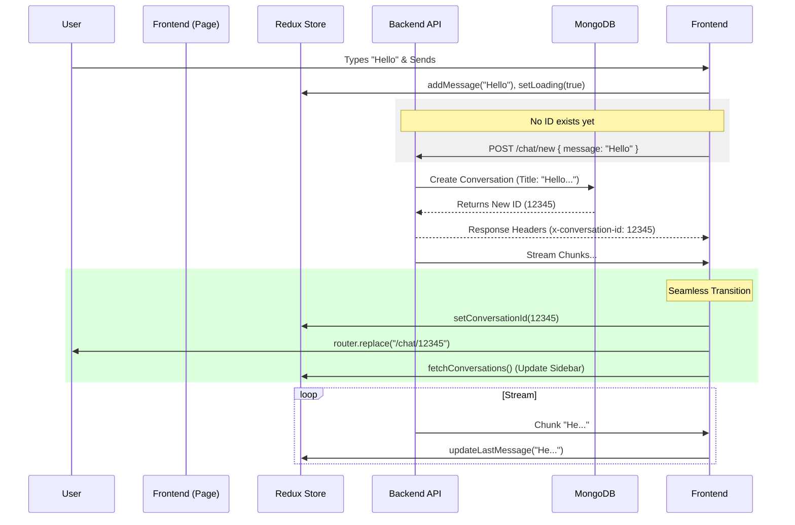

# 🔄 IRAG Conversation & State Management Flow

This document details how the application handles conversation lifecycles, state management, and the seamless transition from a "New Chat" to a persisted conversation.

## 1. High-Level Architecture

The system uses a **URL-driven state** approach combined with **Redux** for global management.
- **URL**: The source of truth for *which* conversation is active.
- **Redux**: The source of truth for the *content* (messages, loading state) of that conversation.

| State | URL | Redux `currentConversationId` | Redux `messages` | UI Behavior |
|-------|-----|-------------------------------|------------------|-------------|
| **New Chat** | `/chat` | `null` | `[]` (Empty) | Shows "Ready to research?" placeholder |
| **Existing** | `/chat/65a...` | `'65a...'` | `[{ role: 'user'... }]` | Renders message history |

---

## 2. Default State (New Conversation)

When a user navigates to `/chat` (no ID):

1. **Route Detection**:
   - `frontend/app/chat/[[...id]]/page.tsx` checks `params.id`.
   - Result: `undefined`.

2. **Effect Hook Trigger**:
   ```typescript
   useEffect(() => {
       if (!conversationIdParam) {
           dispatch(setConversationId(null));
           dispatch(clearMessages());
       }
   }, [conversationIdParam]);
   ```
   - Clears any previous chat data from Redux to ensure a blank slate.

---

## 3. The "First Message" Flow (Creation)

This is the critical moment where a client-side interaction becomes a server-side record.

### Step A: User Clicks Send
The `handleSend()` function in `page.tsx` executes:

1. **Optimistic UI Update**:
   - Dispatches `addMessage({ role: 'user', content: input })` immediately.
   - Dispatches `addMessage({ role: 'assistant', content: '' })` (placeholder for streaming).
   - Sets `isLoading(true)`.

2. **API Request Preparation**:
   - Checks `currentConversationId`. It is `null`.
   - Sets target URL to `/api/ai/chat/new`.
   - Payload includes:
     ```json
     {
         "message": "Hello world",
         "conversationId": null,
         "model": "gpt-4o",
         "useRag": true
     }
     ```

### Step B: Backend Processing (`AIcontroller.js`)

1. **Auto-Creation Logic**:
   - Controller sees `conversationId` is missing/null in the body.
   - **Action**: Creates a new Document in MongoDB `conversations` collection.
   - **Title Generation**: Takes the first 30 chars of the message as the title.
   - **ID Generation**: MongoDB assigns a new `_id` (e.g., `65a1b2c3...`).

2. **The Response Header**:
   - Before streaming the answer, the backend sets a crucial header:
   ```javascript
   res.setHeader('x-conversation-id', newConversation._id);
   ```
   - This allows the frontend to know the new ID *while* the stream is starting.

### Step C: Frontend State Transition (Seamless)

Back in `handleSend()` inside `page.tsx`:

1. **Fetch Response Arrives**:
   ```typescript
   const response = await fetch(...);
   const newId = response.headers.get('x-conversation-id');
   ```

2. **Crucial State Updates**:
   If a `newId` is detected and it differs from current state:
   - `dispatch(setConversationId(newId))` -> Updates Redux.
   - `dispatch(fetchConversations())` -> Refreshes the Sidebar list to show the new chat.
   - `router.replace('/chat/' + newId)` -> **Silently updates the browser URL** without reloading the page.

3. **Stream Handling**:
   - The fetch reader continues reading the AI response stream.
   - `dispatch(updateLastMessageContent(chunk))` appends text to the assistant message in Redux.

---

## 4. Existing Conversation Flow

When navigating to `/chat/65a1b2c3...`:

1. **URL Param Detection**:
   - `params.id` is `'65a1b2c3...'`.

2. **Data Fetching**:
   - `useEffect` dispatches `fetchMessages('65a1b2c3...')`.
   - **Redux Thunk** calls `/api/ai/chat/65a1b2c3...` (GET).
   - Backend queries MongoDB `messages` collection for this `conversation_id`.
   - Redux `messages` array is populated -> UI renders full history.

3. **Continuing the Chat**:
   - `handleSend()` sees `currentConversationId` is NOT null.
   - Sends POST to `/api/ai/chat/65a1b2c3...`.
   - Backend skips creation logic and simply appends the new message to the existing conversation.

---

## 5. Summary Diagram


